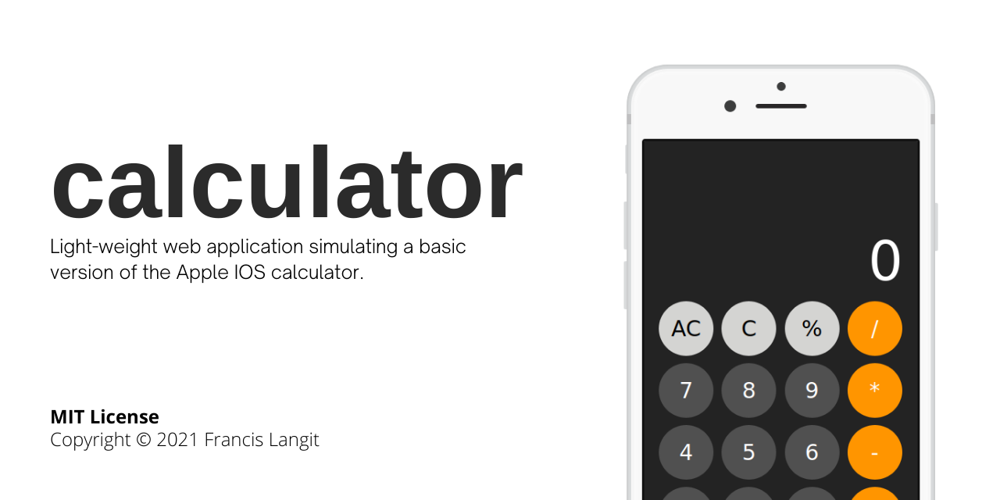
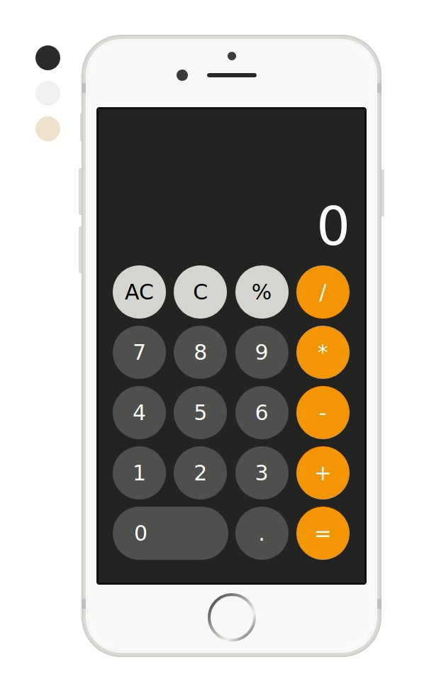

A light-weight web application simulating a basic version of the Apple iPhone calculator. Written on HTML, CSS, and vanilla JavaScript. [Made in partial completion of The Odin Project's Foundations path.](https://www.theodinproject.com/paths/foundations/courses/foundations/lessons/calculator)

## Installation

[Click here for a live deployment of the website on GitHub pages.](https://francislangit.github.io/calculator/)

For those that would like to utilize the repository locally, follow the steps below:

1. Clone the repository. Use `git clone https://github.com/FrancisLangit/calculator` or download it as a `.zip` file.
2. Navigate to wherever the repository has been cloned and open up `index.html` on a web browser.

## Usage

The web application can be used similarly to however one might use a basic calculator. Operator on numbers to your delight and configure the appearance of the device using to color buttons to its side. 

## Contributing

Feel free to submit an issue should a bug be found when utilizing the application. One is also welcome to forward a pull request should they seek to introduce a change.

## License

[MIT License](https://github.com/FrancisLangit/calculator/blob/main/LICENSE)